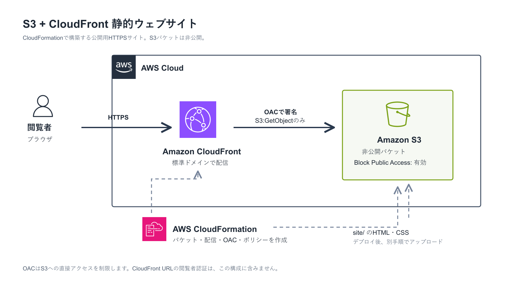

# S3 + CloudFront 静的ウェブサイト（CloudFormation）

非公開のAmazon S3バケットをオリジンにし、Amazon CloudFrontからHTTPSで静的ファイルを配信する構成例です。CloudFormationで基盤を作成し、HTML・CSS・画像は別手順で配置します。`site/`には架空の北海道ラーメン店のサンプルページを用意しています。



## 構成と公開範囲

閲覧者からCloudFrontへはHTTPSで接続します。CloudFrontはOrigin Access Control（OAC）で署名したリクエストをS3へ送り、バケットポリシーはこのDistributionからの読み取りだけを許可します。S3の4種類のBlock Public Accessはすべて有効です。

この構成では、**S3の静的ウェブサイトエンドポイントや`WebsiteConfiguration`は使用しません**。OACは通常のS3バケットオリジンで使用する機能です。また、OACはS3への直接アクセスを防ぎますが、CloudFrontのURLを知る閲覧者を認証する機能ではありません。サンプルサイトは一般公開を前提とし、秘密情報を配置しないでください。

CloudFrontの標準ドメイン（`*.cloudfront.net`）を使用し、独自ドメイン・Route 53・ACM証明書・閲覧者認証は初版の対象外です。

## 作成するリソース

| リソース | 主な設定 |
| --- | --- |
| S3バケット | 自動生成名、非公開、Block Public Accessをすべて有効、ACL無効、SSE-S3、削除時は保持 |
| CloudFront OAC | S3オリジン向け、SigV4で常に署名 |
| CloudFront Distribution | HTTPSへリダイレクト、`index.html`を既定ルート、GET/HEADのみ、`error.html`を404に使用 |
| S3バケットポリシー | 対象Distributionの`AWS:SourceArn`を条件に`GetObject`だけ許可、非TLS通信を拒否 |
| CloudFront Cache Policy | Cookie・クエリ文字列・任意ヘッダーをキャッシュキーへ含めない、短めのTTL |

## 前提条件

- AWS CLI v2を使用でき、対象アカウント／リージョンを確認できること
- CloudFormation、S3、CloudFrontリソースを作成できるIAM権限があること
- 配置する`site/`に個人情報、認証情報、顧客情報を含めないこと
- S3、CloudFront、データ転送などの料金が発生し得ることを理解していること

## スタック作成

### CloudFormationコンソール

1. 対象リージョンを選び、CloudFormationの「スタックの作成」から新しいリソースを使用する。
2. 既存のテンプレートとして`templates/secure-site.yaml`をアップロードする。
3. スタック名を入力する（例：`s3-static-site-lab`）。
4. パラメータ`ProjectName`を確認する。初期値は`aws-s3-static-site-cfn`。同じアカウント・リージョンで複数作成する場合は、リソース名の重複を避けるため別の値にする。
5. 設定内容を確認してスタックを作成し、`CREATE_COMPLETE`まで待つ。このテンプレートにはIAMリソースがないため、IAM作成のCapabilities承認は不要。

### AWS CLI

PowerShellの例です。`$region`にはCloudFormationとS3バケットを作成するリージョンを指定します。CloudFront自体はグローバルなサービスです。

```powershell
$region = 'ap-northeast-1'
aws sts get-caller-identity
aws cloudformation validate-template --template-body file://templates/secure-site.yaml --region $region
aws cloudformation deploy --template-file templates/secure-site.yaml --stack-name s3-static-site-lab --parameter-overrides ProjectName=s3-static-site-lab --region $region
```

## サイトファイルの配置・公開確認

CloudFormationは**空の非公開S3バケットとCloudFrontなどの配信基盤**を作成します。HTML・CSS・画像のアップロードは別途必要です。スタックが`CREATE_COMPLETE`となったら、CloudFormationの「出力」（Outputs）から`BucketName`、`DistributionId`、`SiteUrl`を確認します。

アップロード先は`BucketName`に表示されたS3バケットの**直下**です。`site`というフォルダーをバケット内に作らず、`site/`の**中身**を次のように配置します。

| ローカルのファイル | S3上の配置先 |
| --- | --- |
| `site/index.html` | `s3://バケット名/index.html` |
| `site/error.html` | `s3://バケット名/error.html` |
| `site/styles.css` | `s3://バケット名/styles.css` |
| `site/images/hokkaido-miso-ramen.png` | `s3://バケット名/images/hokkaido-miso-ramen.png` |

### S3コンソールでアップロード

1. S3コンソールで`BucketName`と同じ名前のバケットを開く。
2. 「アップロード」から`site/`内の`index.html`、`error.html`、`styles.css`と`images/`フォルダーを追加する。アップロード先に`site/`が付いていないことを確認する。
3. アップロード後、バケットの「オブジェクト」一覧で上表と同じキーになっていることを確認する。

### AWS CLIでアップロード

PowerShellで`$bucketName`をOutputsの実際の`BucketName`へ置き換えて実行します。リポジトリのルートディレクトリから実行し、初回は`--delete`を付けません。

```powershell
$region = 'ap-northeast-1'
$bucketName = 'Outputsに表示された実際のBucketName'
aws s3 sync .\site\ "s3://$bucketName/" --region $region
```

CloudFrontの反映後に`SiteUrl`へアクセスします。トップページにラーメン店のサンプルサイトと画像が表示され、存在しないパスでは`error.html`とHTTP 404が返ることを確認します。CloudFrontのURLの`/`はバケット直下の`index.html`へ対応します。更新直後に旧内容が残る場合は、キャッシュのTTL経過を待つか、対象DistributionでInvalidationを実行します。

サンプルの店舗名、メニュー、価格、画像はデモ用です。実在店舗の情報ではありません。写真は画像生成ツールで制作しました。

## セキュリティ確認

1. S3バケットのBlock Public Accessが4項目とも有効であることを確認する。
2. バケットポリシーの読み取り許可がCloudFrontサービスプリンシパルと対象Distributionに限定されていることを確認する。
3. S3オブジェクトのURLへ匿名で直接アクセスしても取得できないことを確認する。
4. CloudFrontのHTTP URLがHTTPSへリダイレクトされることを確認する。

## 後片付け

S3バケットには`DeletionPolicy: Retain`を設定しています。スタック削除後もバケットとアップロードしたファイルは残るため、対象バケット名・中身・料金を確認してください。削除する場合は、**このスタックが作成したバケットであることを再確認**してから、ファイルを空にし、残ったバケットを削除します。別用途のバケットを対象にしないでください。
